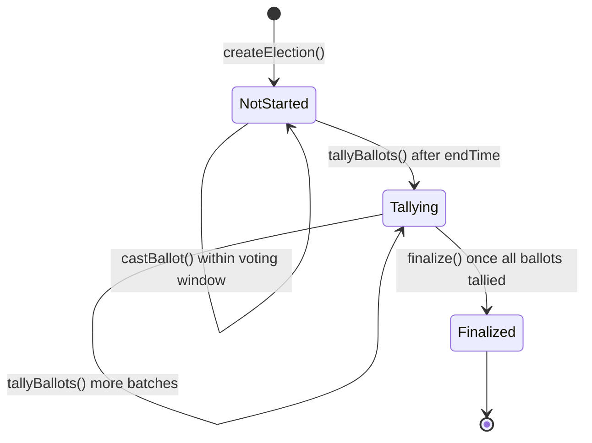
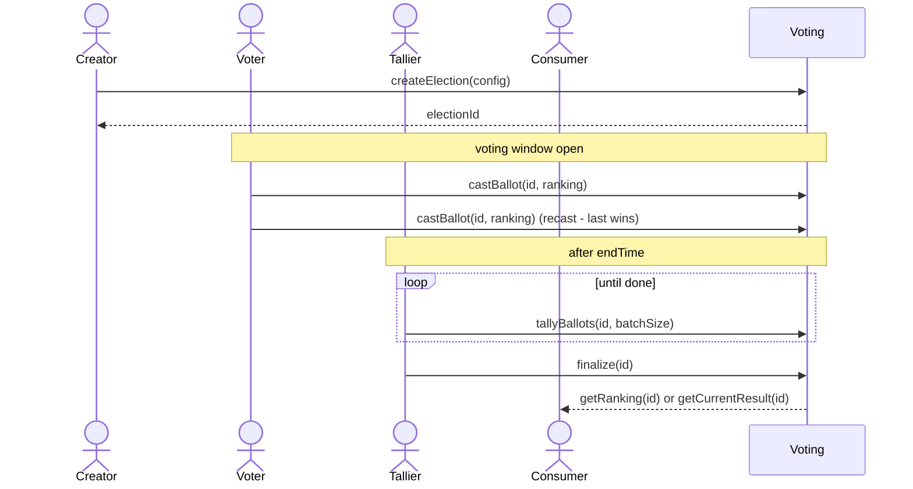
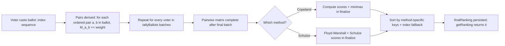

# Voting methods

## 1. Overview

This repository provides two production-shaped Solidity implementations of pairwise-Condorcet ranked-choice voting for on-chain elections: **Copeland** and **Schulze**. Both share a common interface (`IRankedChoiceVoting`), a permissionless lifecycle, and the same ballot semantics — they differ only in how the pairwise preference matrix is reduced to a final ranking. Use this when you need a transparent, deterministic, on-chain ranked-choice tally over an `IVotes`-compatible token; pick **Copeland** for lower gas and simpler explainability, or **Schulze** when you expect Condorcet cycles and want a more discriminating tiebreaker. Copeland or Schulze — your choice.

## 2. The common interface

Both `CopelandVoting` and `SchulzeVoting` implement `IRankedChoiceVoting` (see [`src/interfaces/IRankedChoiceVoting.sol`](../src/interfaces/IRankedChoiceVoting.sol)). The full lifecycle, every event, every error and every shared view are defined there; only the method-specific score getters (e.g. `getCopelandScores`, `getSchulzeScores`) live on the per-method sub-interfaces. Picking a method is therefore a single import and constructor swap — every integration written against `IRankedChoiceVoting` keeps working.

| Function | Purpose |
|---|---|
| `createElection(cfg)` | Open a new election. Permissionless. |
| `castBallot(id, ranking)` | Submit a ranked ballot; replaces any previous from the same voter. |
| `tallyBallots(id, maxBallots)` | Process N voters' ballots into the pairwise matrix. Returns true when done. Anyone can call. |
| `finalize(id)` | Compute the final ranking and lock the result. Anyone can call once tally is complete. |
| `getRanking(id)` | The final ranking. Empty before finalize. |
| `getCurrentResult(id)` | Live preview: what the ranking would be if `finalize` were called right now. Works at any phase. |
| `getElection(id)` | All metadata + lifecycle state. |
| `getBallot(id, voter)` | The voter's current ballot. |
| `getPairwiseMatrix(id)` | The pairwise preference matrix. |
| `getVoters(id)` | List of all voters who cast a ballot. |
| `electionCount()` | How many elections have ever been created. |

Note: method-specific getters live on `ICopelandVoting` / `ISchulzeVoting` (see those sections).

## 3. Election lifecycle

- Lifecycle phases: `NotStarted` (created; voting open OR closed but no tally batches yet), `Tallying` (first `tallyBallots` after `endTime` flips it), `Finalized` (after `finalize`).
- All transitions are time-driven by `endTime` and explicit calls; no automatic state changes.
- The "Tallier" role is permissionless — any address can advance the tally and call finalize.
- `getCurrentResult(id)` works in every phase and never reverts on phase; it lets consumers preview the running tally while votes are still being processed, or inspect the identity ranking before any batches have been counted.
- `castBallot` is rejected after `endTime`; `tallyBallots` is rejected before `endTime` and after `finalize`; `finalize` is rejected until every recorded voter has been processed at least once.

## 4. Ballot semantics

- A ballot is a `uint8[]` of candidate indices, length 0..C.
- Order = preference: `ranking[0]` is the voter's most-preferred candidate.
- Partial rankings are explicitly allowed. Unranked candidates contribute NO pairs; they're treated as "no preference expressed."
- Duplicates revert (`DuplicateRanking`).
- Indices out of range revert (`CandidateIndexOutOfBounds`).
- Recasting before `endTime` overwrites the previous ballot completely.
- The voter's weight is read at `snapshotBlock` via `IVotes.getPastVotes`, only during `tallyBallots` — not at cast time. Zero-weight voters can cast; their ballot contributes nothing.

The "no pairs for unranked candidates" rule matters for real elections: a voter who only knows the first three candidates can rank just those three and remain silent on the rest, without their silence being interpreted as a tie or a last-place vote. Concretely, a ballot `[2, 0]` on a 4-candidate election contributes the pairs `(2 > 0)`, `(2 > 1)` only if 1 is also ranked — it isn't — so the only contributed pair is `(2 > 0)`. Candidates 1 and 3 receive zero contribution from this voter in either direction. This is the standard "vote-against-omission" semantics and matches how off-chain Schulze/Copeland implementations behave.

## 5. Tally processing

Tallying is split into two phases for gas reasons: `tallyBallots` is paginated so each call processes at most `maxBallots` voters, accumulating weighted pairs into the pairwise matrix without ever needing to load every ballot in one transaction. Once every voter has been processed, a single `finalize` call consumes the completed matrix and writes the final ranking. This keeps per-transaction gas bounded by `maxBallots × C²` rather than by the entire voter set.

Two practical consequences:

- A voter's weight is read **once**, the first time their ballot is processed in a `tallyBallots` batch — not at cast time. If an attacker transfers tokens after `snapshotBlock` it has no effect; `IVotes.getPastVotes` is the only weight source.
- Empty or zero-weight ballots contribute nothing and cost nothing in the matrix update path, but they still count toward the `ballotsProcessed` counter so `finalize` is reachable.

## 6. Copeland method

Algorithm:
- For each candidate i: `score[i] = (# of opponents i beats head-to-head) − (# of opponents that beat i)`.
- Tiebreaker 1: **Minimax** — `minimax[i] = min over opponents j of (M[i][j] − M[j][i])`. Higher (less negative) = better.
- Tiebreaker 2: candidate index ascending.

**Worked example** (the same Alice 1>0>2 scenario from tests):
- 3 candidates: A=0, B=1, C=2. One voter (Alice) with weight 10 ranks `B > A > C`.
- Pairwise matrix (rows = i, cols = j; cell = weight of voters who preferred i over j):

  |    | A | B | C |
  |----|---|---|---|
  | A  | 0 | 0 | 10 |
  | B  | 10 | 0 | 10 |
  | C  | 0 | 0 | 0 |

- Pairwise margins m[i][j] = M[i][j] − M[j][i]:
  - A vs B: 0 − 10 = −10  (A loses)
  - A vs C: 10 − 0 = +10 (A wins)
  - B vs A: 10 − 0 = +10 (B wins)
  - B vs C: 10 − 0 = +10 (B wins)
  - C vs A: 0 − 10 = −10 (C loses)
  - C vs B: 0 − 10 = −10 (C loses)
- Copeland scores: A = 0 (1 win, 1 loss), B = 2 (2 wins), C = −2 (2 losses).
- Minimax: A = min(−10, +10) = −10. B = min(+10, +10) = +10. C = min(−10, −10) = −10.
- Sort by (score desc, minimax desc, index asc):
  - B (score=2, minimax=10)
  - A (score=0, minimax=−10, index=0)
  - C (score=−2, minimax=−10, index=2)
- **Final ranking: `[1, 0, 2]`** = `[B, A, C]`.

## 7. Schulze method

Algorithm:
- Build strongest-paths matrix `p[i][j]` via Floyd-Warshall over the *widest-path* semiring:
  - **Init:** `p[i][j] = d[i][j] if d[i][j] > d[j][i], else 0`.
  - **Iterate:** for each k, i, j (distinct): `p[i][j] = max(p[i][j], min(p[i][k], p[k][j]))`.
- Schulze score: `s[i] = count of opponents j (j ≠ i) with p[i][j] > p[j][i]`.
- Tiebreaker: candidate index ascending. (Note: Copeland's two-level tiebreaker (Minimax then index) is *not* applied here — Schulze tends to discriminate more strongly via its path strengths.)

**Worked example 1** (small, easy to verify): same Alice 1>0>2 setup as Copeland example.
- d matrix is the same as M above.
- Init p: p[A][B]=0, p[A][C]=10, p[B][A]=10, p[B][C]=10, p[C][A]=0, p[C][B]=0.
- After Floyd-Warshall (no improvements found in any iteration for this case — verify by quick trace), p is unchanged.
- Scores: A beats C via p[A][C]=10 > p[C][A]=0 → 1. B beats A (10>0) and C (10>0) → 2. C beats nobody → 0.
- Sort by (score desc, index asc): B, A, C → **`[1, 0, 2]`**.

In this simple case Copeland and Schulze agree, as they should for any Condorcet-like setup.

**Worked example 2** (Wikipedia 5-candidate cycle case): the [Wikipedia Schulze method article](https://en.wikipedia.org/wiki/Schulze_method) carries a canonical 45-voter, 5-candidate scenario (`A..E`) whose pairwise matrix contains several head-to-head reversals — none of A through E is a Condorcet winner on direct pairwise comparison alone. Floyd-Warshall over the widest-path semiring resolves the cycle by routing preferences through intermediate candidates; the strongest-paths matrix yields the final ranking `[E, A, C, B, D]`. The test [`test_wikipediaExample`](../test/SchulzeVoting.scenarios.t.sol) reproduces both the input matrix and the expected output byte-for-byte, and serves as the executable reference for anyone debugging the algorithm or porting it to another language.

Why the second tiebreaker is shorter than Copeland's: Schulze's score already incorporates transitive defeat strength, so most ties Copeland would resolve by Minimax are already separated by the score itself. The index fallback exists only for the strictly symmetric cases (e.g., the "perfectly rotated cycle" in tests) where every candidate is interchangeable up to relabeling.

## 8. Choosing between methods

| Aspect | Copeland | Schulze |
|---|---|---|
| Asymptotic `finalize` cost | O(C²) | O(C³) |
| `finalize` gas at C=10 (measured) | ~679k | ~1.11M |
| `finalize` gas at C=64 | not benchmarked; scales ~O(C²) read + O(C) write | not benchmarked; scales ~O(C³) |
| `getCurrentResult` view at C=10 (measured) | ~130k | ~823k |
| `createElection` / `castBallot` / `tallyBallots` | identical (shared code) | identical (shared code) |
| Resolves asymmetric Condorcet cycles? | No — falls back to index | Yes, via path strengths |
| Resolves symmetric (perfectly-rotated) cycles? | No | No (both fall back to index) |
| Explainability to non-experts | Easier | Harder |
| When to choose | Default; lower cost; explicit "tied → first-listed candidate wins" is acceptable | When you expect cycles and want decisive non-arbitrary resolution |

The two methods differ **only** at `finalize` and the result-views. Everything on the write path before finalize — `createElection`, `castBallot`, and `tallyBallots` — is identical code, so it costs the same regardless of method. See the reference benchmark below.

### Reference benchmark — 100 voters × 10 candidates

Measured by `test_gasBenchmark_{copeland,schulze}_100voters_10candidates` in [`test/Gas.benchmark.t.sol`](../test/Gas.benchmark.t.sol). Ballots are partial (4–7 candidates each); the tally is batched at 20 voters per call (5 batches). Reproduce with `forge test --match-contract GasBenchmark -vvv`.

| Phase | Who pays | Txs | Copeland | Schulze |
|---|---|---|---|---|
| `createElection` | creator | 1 | ~645k | ~645k |
| `castBallot` (first / avg) | each voter | 100 | ~134k / ~111k | ~134k / ~111k |
| `castBallot` (total of 100) | voters, collectively | — | ~11.06M | ~11.06M |
| `tallyBallots` (per batch of 20) | tallier(s) | 5 | ~768k | ~768k |
| `tallyBallots` (total) | tallier(s) | — | ~3.84M | ~3.84M |
| `finalize` | anyone | 1 | ~679k | ~1.11M |
| `getCurrentResult` (view, post-finalize) | — | — | ~130k | ~823k |
| **Grand total (write path)** | — | **107 txs** | **~16.2M** | **~16.7M** |

The ~16M grand total is **not a single transaction** — it is spread across 107 transactions (1 create + 100 individual ballot casts + 5 tally batches + 1 finalize). No single transaction exceeds ~1.11M gas (Schulze finalize), comfortably under the ~30M mainnet block limit. The dominant aggregate cost (`castBallot`, ~11M) is borne by voters one at a time (~111k each), not by any single party.

In practice, the two methods agree on the winner in the overwhelming majority of realistic elections — any scenario with a true Condorcet winner produces the same result under both. Where they diverge is exactly the case Schulze was designed for: cyclical pairwise preferences (A beats B, B beats C, C beats A) where Copeland's score alone cannot distinguish the cycle members and the index tiebreaker has to step in. The cross-method invariant tests assert this Condorcet agreement explicitly.

## 9. Parameters & limits

- `MAX_CANDIDATES = 64`. Hard cap to keep `finalize` gas manageable.
- Ballot length: 0..C (any subset is allowed).
- Vote weight: read from `IVotes.getPastVotes(voter, snapshotBlock)`. Must fit in `int256`; reverts with `WeightExceedsInt256Max` otherwise.
- `snapshotBlock` must be strictly past at creation (`< block.number`).
- `endTime > startTime` and `endTime > block.timestamp` at creation.
- Permissionless: anyone can create, anyone can cast (with weight), anyone can tally, anyone can finalize.

## 10. Tie resolution summary

| Method | Primary key | Tiebreaker 1 | Tiebreaker 2 |
|---|---|---|---|
| Copeland | Copeland score (wins − losses, signed) | Minimax (smallest worst-defeat margin) | Candidate index ascending |
| Schulze | Schulze score (count of opponents beaten via strongest paths) | — | Candidate index ascending |

In both methods, the candidate-index fallback guarantees a strict total order.

## 11. Production-readiness notes

- Both contracts use OpenZeppelin's `ReentrancyGuard`.
- Token weights are bounded against int256 overflow (`WeightExceedsInt256Max`).
- Storage layout is parallel between the two contracts but they do NOT share storage; they're independent deployments.
- **Neither contract has been independently audited.** This is production-shaped, not production-blessed.
- Determinism: both methods are fully deterministic given the same pairwise matrix; the cross-method invariant tests in [`test/CrossMethod.invariants.t.sol`](../test/CrossMethod.invariants.t.sol) exercise this together with the identity-ranking guarantee (`getCurrentResult` on a freshly-created election returns `[0..C-1]`).
- The 100-voter × 10-candidate figures in §8 are **measured** by `test/Gas.benchmark.t.sol` (run `forge test --match-contract GasBenchmark -vvv`), not estimated. Treat them as representative of that specific shape, not contractual SLAs — real costs depend on the candidate count `C` (matrix work scales O(C²), Schulze finalize O(C³)), ballot-length distribution, the EVM gas schedule of the target chain, and how many `tallyBallots` batches a given election needs. The C=64 cells are extrapolations and are not benchmarked.

## 12. Further reading

- Spec: [`docs/superpowers/specs/2026-05-25-multi-method-voting-design.md`](./superpowers/specs/2026-05-25-multi-method-voting-design.md)
- Original Copeland spec: [`docs/superpowers/specs/2026-05-24-copeland-voting-design.md`](./superpowers/specs/2026-05-24-copeland-voting-design.md)
- Wikipedia — [Schulze method](https://en.wikipedia.org/wiki/Schulze_method), [Copeland's method](https://en.wikipedia.org/wiki/Copeland%27s_method), [Condorcet method](https://en.wikipedia.org/wiki/Condorcet_method)
